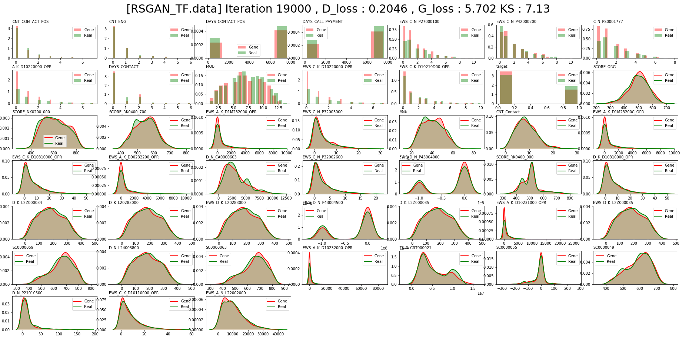

# Real-Data-Generate
이미지가 아닌 일반 데이터 생성

여러가지 테스트 진행 
https://paper.dropbox.com/doc/Gan--AXDdekOtz5AxGgCP3LwcmAEOAg-rXyk0KE916Z11gRtaLQS6

Metric
  - Gan에서 흔히 사용하는 것들
    - 학습된 이미지 네트워크에 있는 layer 값이나 결과값을 활용해서 만드는 것이 때문에 똑같이 사용하는 것은 어려움.
    - Fréchet Inception Distance (FID) , Inception Score (IS)
  - KS
    - 현재는 분포 별로 KS를 측정해서 진행중
    - 실제 샘플과 가짜 샘플 사이에 KS 통계량 값이 0에 가까워 질수록 같은 분포로 볼 수 있을 수 있을 것 같아서 진행중.
    - 현재는 KS가 특정 숫자보다 작아지면 모델을 저장하고 샘플을 생성하게 진행함. 
         그리고  작아진 숫자가 다시 기준이 됨.
    - 단점 : 학습시 KS 값의 차이가 Loss로 반영을 못한 상태.
      - 이 부분에 대한 고민 진행중
        - 테스트 중인 방법은 제약조건을 주는 방식으로 진행중 
        - 전체 변수의 ks 평균 값과 가짜

     

Appendix
- GAN
  - https://arxiv.org/abs/1406.2661
- CGAN
  - https://arxiv.org/abs/1411.1784
- LSGAN
  - https://arxiv.org/abs/1611.04076
- InfoGan
  - https://arxiv.org/abs/1606.03657
- Dist-Gan
  - https://arxiv.org/abs/1803.08887
- MAGAN
  - https://arxiv.org/abs/1704.03817
- SoftMax GAN 
  - https://arxiv.org/abs/1704.06191
- Boundary Seek Gan
  - https://arxiv.org/abs/1702.08431
- Dragan
  - https://arxiv.org/abs/1705.07215
- Wgan
  - https://arxiv.org/abs/1701.07875
- Wgan -Gp
  - https://arxiv.org/pdf/1704.00028.pdf
- SNGan
  - https://arxiv.org/abs/1802.05957
- Style-Based Gan 에서 Mapping Network Idea
  - https://arxiv.org/abs/1812.04948
- The relativistic discriminator: a key element missing from standard GAN
  - https://arxiv.org/pdf/1807.00734.pdf
